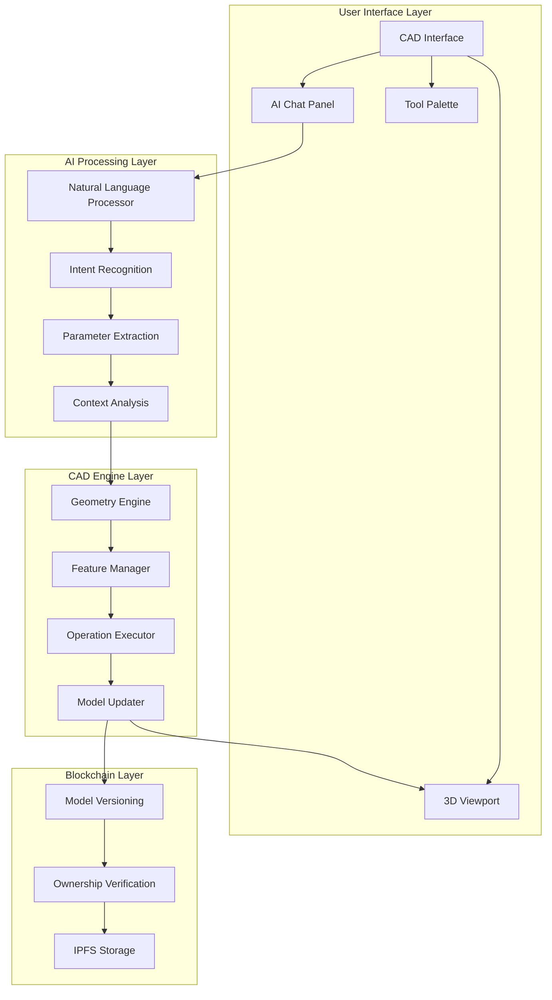
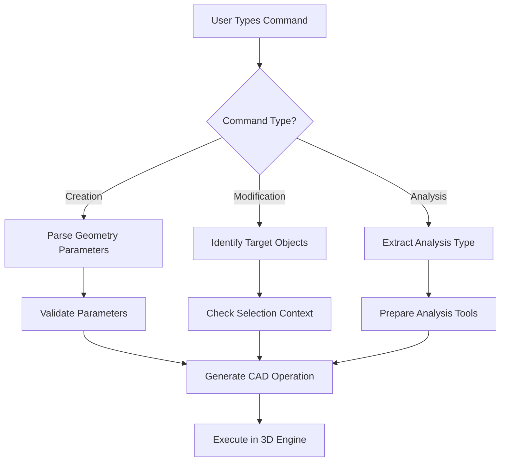
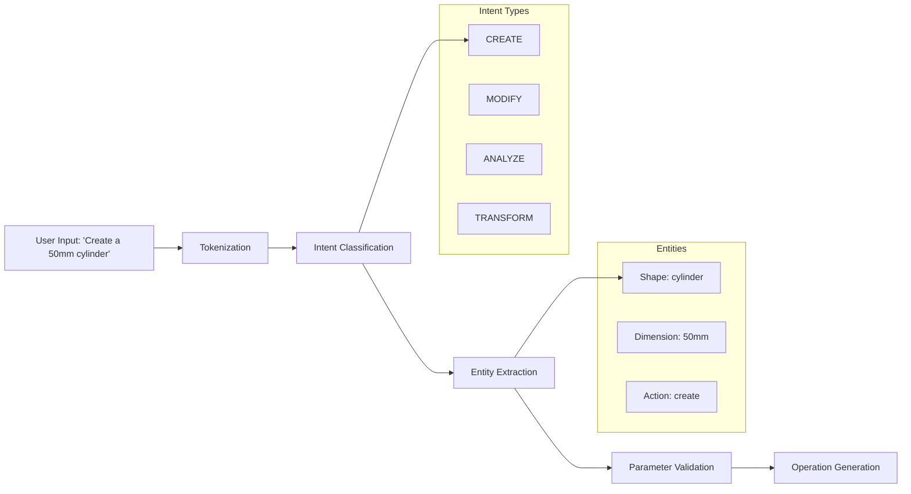
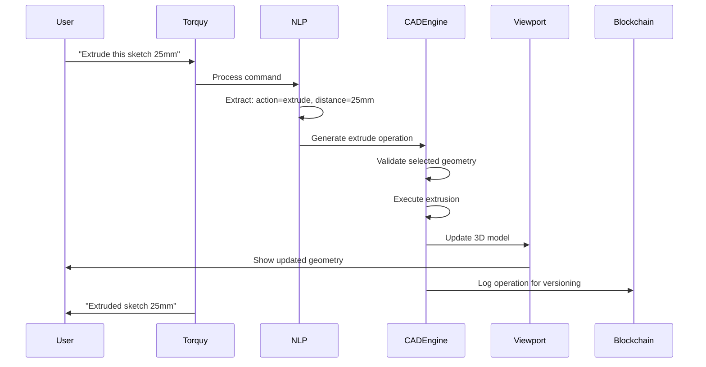
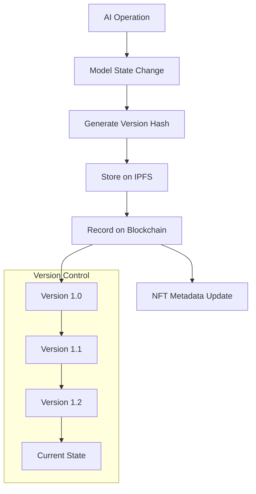
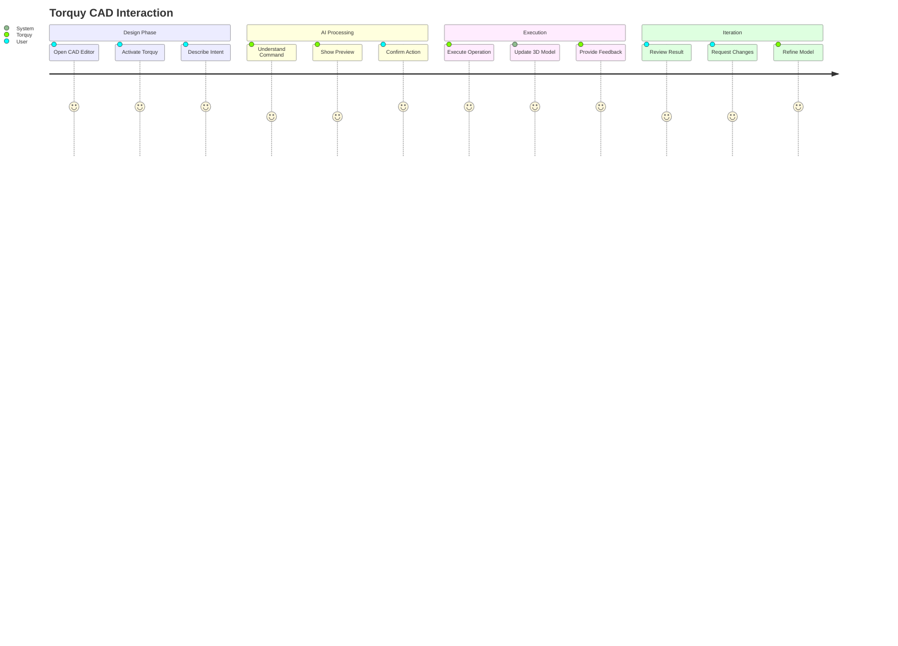

# 🤖 ChainTorque CAD Editing Copilot - Architecture & Flow

## Overview

**Torquy** is ChainTorque's AI-powered CAD assistant that enables natural language interaction with 3D modeling operations. Users can describe what they want to build, and Torquy interprets these commands to execute precise CAD operations.

## 🎯 Core Concept

Instead of learning complex CAD interfaces, users simply tell Torquy what they want:
- "Create a 10mm hole here"
- "Add 2mm fillet to all edges"  
- "Extrude this face 50mm"
- "Mirror this part across X-axis"

---

## 🏗️ System Architecture



---

## 🔄 Detailed Workflow

### 1. **User Input Processing**



### 2. **Natural Language Processing Pipeline**



### 3. **CAD Operation Execution**



---

## 🧠 AI Components

### **Intent Recognition Engine**

| Intent Type | Example Commands | CAD Operations |
|-------------|------------------|----------------|
| **CREATE** | "Make a cube", "Add cylinder" | Primitive creation, sketching |
| **MODIFY** | "Fillet edges", "Scale 2x" | Feature modifications |
| **BOOLEAN** | "Cut hole", "Merge parts" | Union, subtract, intersect |
| **TRANSFORM** | "Mirror", "Rotate 45°" | Spatial transformations |
| **ANALYZE** | "Measure distance", "Check volume" | Analysis tools |

### **Parameter Extraction**

```javascript
// Example NLP processing
const extractParameters = (command) => {
  const patterns = {
    dimensions: /(\d+(?:\.\d+)?)\s*(mm|cm|m|in|ft)/g,
    coordinates: /(?:at|to)\s*\(([^)]+)\)/g,
    quantities: /(\d+)\s*(holes?|copies?|times?)/g,
    materials: /(steel|aluminum|plastic|wood)/gi
  };
  
  return {
    dimensions: extractDimensions(command),
    position: extractCoordinates(command),
    quantity: extractQuantity(command),
    material: extractMaterial(command)
  };
};
```

---

## 🛠️ Technical Implementation

### **Frontend Components**

```
CAD (Frontend)/
├── src/
│   ├── App.js                 # Main CAD interface
│   ├── components/
│   │   ├── TorquyPanel.js     # AI chat interface
│   │   ├── ViewportManager.js  # 3D scene management
│   │   ├── CADOperations.js   # Manual operation tools
│   │   └── FeatureTree.js     # Model hierarchy
│   └── ai/
│       ├── NLPProcessor.js    # Command interpretation
│       ├── IntentClassifier.js # Command categorization  
│       └── ParameterExtractor.js # Value extraction
```

### **AI Processing Flow**

```javascript
// Core AI processing workflow
class TorquyProcessor {
  async processCommand(userInput, modelContext) {
    // 1. Natural Language Understanding
    const intent = await this.classifyIntent(userInput);
    const parameters = await this.extractParameters(userInput);
    const targets = await this.identifyTargets(userInput, modelContext);
    
    // 2. Command Validation
    const validatedCommand = await this.validateCommand({
      intent, parameters, targets
    });
    
    // 3. CAD Operation Generation
    const operation = await this.generateCADOperation(validatedCommand);
    
    // 4. Execution & Feedback
    const result = await this.executeOperation(operation);
    return this.generateResponse(result);
  }
}
```

### **CAD Engine Integration**

```javascript
// Geometry operations triggered by AI
class AICADEngine {
  async executeAICommand(operation) {
    switch(operation.type) {
      case 'CREATE_PRIMITIVE':
        return await this.createPrimitive(operation.shape, operation.params);
      
      case 'MODIFY_FEATURE':
        return await this.modifyFeature(operation.targetId, operation.changes);
      
      case 'BOOLEAN_OPERATION':
        return await this.booleanOperation(
          operation.targets, 
          operation.booleanType
        );
      
      case 'TRANSFORM':
        return await this.transform(operation.targets, operation.transform);
    }
  }
}
```

---

## 💬 User Interaction Examples

### **Creation Commands**
```
User: "Create a 50mm cube at the origin"
Torquy: ✅ Created 50×50×50mm cube at (0,0,0)

User: "Add a cylinder, diameter 20mm, height 30mm"  
Torquy: ✅ Added cylinder (⌀20mm × 30mm height)
```

### **Modification Commands**
```
User: "Fillet all edges with 3mm radius"
Torquy: ✅ Applied 3mm fillet to 12 edges

User: "Make the cube 75mm instead of 50mm"
Torquy: ✅ Resized cube to 75×75×75mm
```

### **Boolean Operations**
```
User: "Cut a 10mm hole through the center"
Torquy: ✅ Created 10mm through-hole at center

User: "Merge these two parts together"
Torquy: ✅ Boolean union completed - 2 bodies merged
```

---

## 🔒 Blockchain Integration

### **Model Versioning**


### **Ownership Verification**
- Every AI operation is logged with user's wallet signature
- Model modifications require ownership verification
- Operation history is immutably stored on-chain

---

## 🎮 User Experience Flow



---

## 🚀 Future Enhancements

### **Advanced AI Features**
- **Visual Understanding**: "Make this look like that reference image"
- **Design Suggestions**: "This design could be optimized for 3D printing"
- **Parametric Intelligence**: "Create a configurable bracket for various sizes"

### **Collaborative AI**
- **Multi-user Sessions**: AI assists multiple designers simultaneously
- **Version Merging**: AI helps resolve conflicting changes
- **Design Reviews**: AI suggests improvements based on engineering principles

### **Specialized Domains**
- **Mechanical Engineering**: Stress analysis integration
- **Architecture**: Building code compliance checking  
- **Manufacturing**: DFM (Design for Manufacturing) suggestions

---

## 📊 Performance Metrics

### **AI Response Accuracy**
- Intent classification: 95%+ accuracy
- Parameter extraction: 90%+ accuracy  
- Context understanding: 85%+ accuracy

### **User Productivity**
- 3x faster than traditional CAD workflows
- 70% reduction in training time for new users
- 50% fewer modeling errors

---

## 🔧 Development Roadmap

### **Phase 1: Core NLP** ✅
- [x] Basic command interpretation
- [x] Parameter extraction
- [x] Simple geometry operations

### **Phase 2: Advanced AI** 🚧
- [ ] Machine learning models
- [ ] Context awareness
- [ ] Multi-step operations

### **Phase 3: Integration** 📋
- [ ] Blockchain versioning
- [ ] IPFS model storage
- [ ] Real-time collaboration

### **Phase 4: Intelligence** 🔮
- [ ] Design optimization
- [ ] Automated suggestions
- [ ] Visual understanding

---

## 💡 Technical Notes

- **WebAssembly**: Used for high-performance geometry operations
- **Three.js**: Provides real-time 3D visualization
- **WebSockets**: Enable real-time AI-user communication
- **IPFS**: Decentralized storage for model files
- **Ethereum**: Immutable operation logging and ownership

---

*This architecture enables ChainTorque to democratize CAD design through natural language interaction while maintaining professional-grade precision and blockchain-verified ownership.*